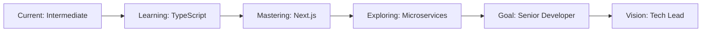

<div align="center">⚡ Vipin Yadav | Crafting Digital Experiences ⚡</div>

<div align="center">
  
</div>

<div align="center">
  
</div>

<br>

<div align="center">
  <a href="https://vipinyadav01.vercel.app/" target="_blank">
    
  </a>
  <a href="https://linkedin.com/in/vipinyadav01" target="_blank">
    
  </a>
  <a href="mailto:Vipinyadav9m@gmail.com">
    
  </a>
  <a href="https://twitter.com/vipinyadav9m" target="_blank">
    
  </a>
</div>

<div align="center">
  
  
  
</div>

---

<br>

<table align="center">
<tr>
<td width="50%" align="center">

## 🎯 **CURRENT MISSION**

```javascript
const currentFocus = {
    role: "Full Stack MERN Developer",
    level: "Intermediate → Advanced",
    building: "Scalable Web Applications",
    mastering: ["TypeScript", "Next.js", "Microservices"],
    goal: "Senior Developer by 2027",
    availability: "Open for opportunities"
};

console.log("Ready to innovate! 🚀");
```

</td>
<td width="50%" align="center">

## 🔥 **QUICK STATS**


</td>
</tr>
</table>

<br>

##  **WHO AM I?**

<div align="center">
  
</div>

<br>

<div align="center">

### 💫 **DEVELOPER PROFILE**

</div>

<table align="center">
<tr>
<td>

```typescript
interface VipinYadav {
    name: string;
    location: string;
    education: string;
    experience: string;
    specialization: string[];
    mindset: string;
}

const developer: VipinYadav = {
    name: "Vipin Yadav",
    location: "India 🇮🇳",
    education: "GLA University Graduate",
    experience: "2+ Years Building Web Apps",
    specialization: [
        "MERN Stack Architecture",
        "Responsive Design Systems", 
        "RESTful API Development",
        "Database Optimization",
        "Performance Engineering"
    ],
    mindset: "Code with purpose, design with passion"
};
```

</td>
</tr>
</table>

<br>

##  **TECH ARSENAL**

<div align="center">

### 🎨 **Frontend Mastery**
<div>
    
</div>
<br>

### ⚙️ **Backend Power**
<div>
    
</div>
<br>

### 🛠️ **DevOps & Tools**
<div>
    
</div>
</div>

<br>

##  **GITHUB ANALYTICS**

<div align="center">
    
    
</div>

<br>

<div align="center">
    
</div>

<br>

##  **FEATURED PROJECTS**

<div align="center">

<table>
<tr>
<td width="50%" align="center">

### 🛍️ **ZERO FASHION** 
*Full-Stack E-commerce Platform*

[](https://github.com/vipinyadav01/ZERO--FASHION--MERN)

**🔥 Features:** React.js • Node.js • MongoDB • Payment Integration • Admin Dashboard

</td>
<td width="50%" align="center">

### 📚 **LEARNING MANAGEMENT** 
*Educational Platform System*

[](https://github.com/vipinyadav01/onlineLearningManagementSystem)

**🚀 Features:** MERN Stack • User Authentication • Course Management • Progress Tracking

</td>
</tr>
</table>

<br>

<a href="https://github.com/vipinyadav01?tab=repositories" target="_blank">
    
</a>

</div>

<br>

##  **CONTRIBUTION PATTERNS**

<div align="center">
    
</div>

<br>

<div align="center">
    
    
    
    
</div>

<br>

##  **DEVELOPMENT JOURNEY**

<div align="center">

<details>
<summary><b>🚀 MERN Stack Expertise</b></summary>
<br>

| Technology | Experience Level | Projects Built |
|------------|------------------|----------------|
| **React.js** | ⭐⭐⭐⭐ | 10+ Applications |
| **Node.js** | ⭐⭐⭐⭐ | 20+ APIs |
| **MongoDB** | ⭐⭐⭐⭐ | 25+ Databases |
| **Express.js** | ⭐⭐⭐⭐ | 20+ Backends |
| **Redux** | ⭐⭐⭐ | 9+ State Management |
| **TypeScript** | ⭐⭐⭐ | 2+ Type-Safe Apps |

</details>

<details>
<summary><b>💼 Professional Achievements</b></summary>
<br>

```markdown
✅ Built 25+ responsive web applications
✅ Optimized database queries reducing load time by 40%
✅ Implemented JWT authentication for secure user sessions
✅ Created reusable component libraries
✅ Deployed scalable applications on cloud platforms
✅ Mentored junior developers in MERN stack
```

</details>

<details>
<summary><b>🎯 Future Roadmap</b></summary>
<br>



</details>

</div>

<br>

##  **LET'S CONNECT**

<div align="center">
    
<table>
<tr>
<td align="center" width="25%">

### 💼 **PROFESSIONAL**
[](https://linkedin.com/in/vipinyadav01)

</td>
<td align="center" width="25%">

### 🌐 **PORTFOLIO**
[](https://vipinyadav01.vercel.app/)

</td>
<td align="center" width="25%">

### 📧 **EMAIL**
[](mailto:Vipinyadav9m@gmail.com)

</td>
<td align="center" width="25%">

### 🐦 **SOCIAL**
[](https://twitter.com/vipinyadav9m)

</td>
</tr>
</table>

<br>

### 🤝 **COLLABORATION OPPORTUNITIES**


</div>

<br>

---

<div align="center">
    
</div>

<div align="center">
    
</div>

<div align="center">
    <sub>⚡ Crafted with passion by <a href="https://github.com/vipinyadav01">Vipin Yadav</a> • Last updated: 2025</sub>
</div>
