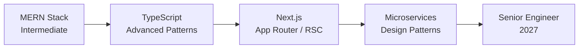

<div align="center">
  
</div>

<br />

<div align="center">
  <a href="https://linkedin.com/in/vipinyadav01"></a>
  &nbsp;
  <a href="https://devxvipin.me"></a>
  &nbsp;
  <a href="mailto:Vipinyadav9m@gmail.com"></a>
  &nbsp;
  <a href="https://twitter.com/vipinyadav9m"></a>
  &nbsp;
  <a href="https://zerofashion.vercel.app/"></a>
</div>

<br />

```ts
const vipin = {
  role:       "Full-Stack Engineer",
  focus:      ["TypeScript", "Next.js", "Microservices"],
  stack:      ["React", "Node.js", "MongoDB", "Redis", "Docker"],
  education:  "B.Tech CSE — GLA University",
  experience: "2+ years building production web apps",
  status:     "Open for opportunities",
  goal:       "Senior Engineer by 2027",
};
```

---

### ⚡ What I've Shipped

- ✅ **25+ production-grade** responsive web applications
- ✅ **40% reduction** in DB query load time via indexing & query optimization
- ✅ **JWT + role-based auth** implemented across multiple platforms
- ✅ **Reusable component libraries** consumed across projects
- ✅ **Cloud-deployed** apps on Vercel & DigitalOcean with CI/CD pipelines
- ✅ **Mentored junior devs** in MERN stack patterns and best practices

---

### 🛠️ Tech Stack

**Frontend**


**Backend**


**Database & Cache**


**DevOps & Tooling**


---

### 🚀 Featured Projects

| Project | What it does | Stack | Link |
|:--------|:------------|:------|:-----|
| **Zero Fashion** | Full-stack e-commerce — product catalog, cart, admin dashboard, payment gateway, order lifecycle management | React · Node.js · MongoDB · Redux | [GitHub](https://github.com/vipinyadav01/ZERO--FASHION--MERN) · [Live](https://zerofashion.vercel.app/) |
| **Online LMS** | Learning management system — course creation, enrollment flow, student progress tracking, secure JWT auth | MERN · JWT · Material UI | [GitHub](https://github.com/vipinyadav01/onlineLearningManagementSystem) |

---

### 🗺️ Engineering Roadmap


```mermaid
graph LR
    A[MERN Stack<br/>Intermediate] --> B[TypeScript<br/>Advanced Patterns]
    B --> C[Next.js<br/>App Router / RSC]
    C --> D[Microservices<br/>Design Patterns]
    D --> E[Senior Engineer<br/>2027]
```

---

### 📊 GitHub Stats

<div align="center">
  
  
</div>

<div align="center">
  
</div>

<br />

<div align="center">
  <a href="https://app.daily.dev/vipinyadav1">
    
  </a>
</div>

---

<div align="center">
  <sub>Open to full-time roles & freelance • <a href="mailto:Vipinyadav9m@gmail.com">Vipinyadav9m@gmail.com</a></sub>
</div>

<div align="center">
  
</div>
